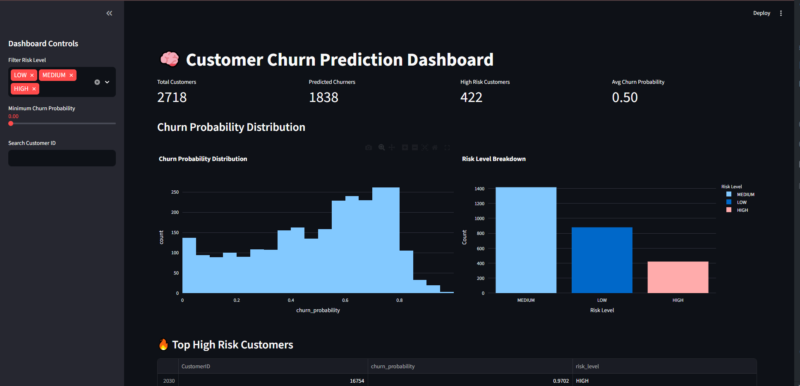
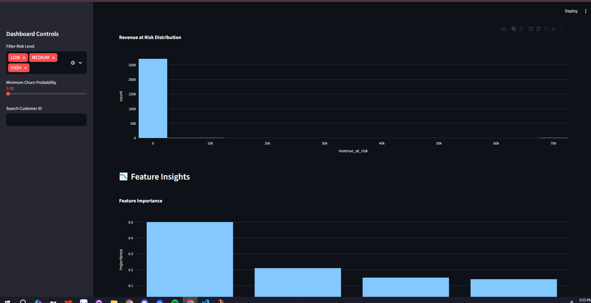
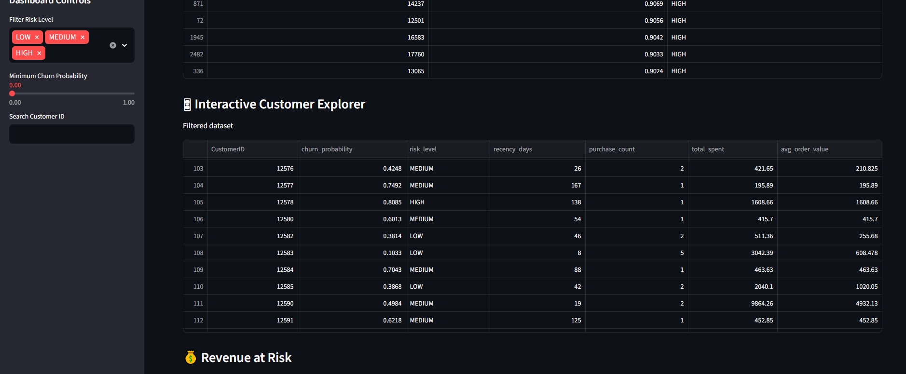

# ML-Churn-Analysis

An end-to-end **machine learning system for predicting customer churn** using retail transaction data.

This project builds a full data pipeline including:

- data ingestion
- feature engineering
- churn modeling
- machine learning training
- prediction pipeline
- interactive analytics dashboard

The system allows businesses to **identify high-risk customers and estimate revenue at risk.**

---

# Project Overview

Customer churn is a major problem in retail and subscription businesses. Identifying customers likely to churn allows companies to:

- target retention campaigns
- prioritize high-risk customers
- reduce revenue loss

This project builds a **machine learning pipeline** that predicts churn using historical transaction data.

---

# Dataset

Source:

UCI Machine Learning Repository  
Online Retail Dataset

Dataset characteristics:

Rows:

541,909

Columns:

InvoiceNo  
StockCode  
Description  
Quantity  
InvoiceDate  
UnitPrice  
CustomerID  
Country  

Each row represents a **product purchased within a transaction.**

---

# Machine Learning Pipeline

The system follows this pipeline:

Raw Retail Data  
↓  
Data Cleaning  
↓  
Feature Engineering  
↓  
Snapshot Churn Dataset  
↓  
Model Training  
↓  
Prediction Pipeline  
↓  
Interactive Dashboard  

---

# Feature Engineering

Customer features are built using **RFM-style metrics**.

Features used by the model:

recency_days  
purchase_count  
total_spent  
avg_order_value  

These features capture:

- how recently a customer purchased
- how often they purchase
- how much they spend

---

# Churn Definition

Churn is defined using **snapshot modeling**.

Example:

Snapshot Date: June 1, 2011

Features use data **before the snapshot**.

Customers are labeled churned if they **do not purchase within the next 90 days**.

This approach prevents **data leakage** and reflects how churn models are built in industry.

---

# Model Training

Models tested:

Logistic Regression  
Random Forest  
Gradient Boosting  

Evaluation metrics:

Accuracy  
Precision  
Recall  
F1 Score  
ROC AUC  

Best performing model:

Gradient Boosting  
ROC AUC ≈ 0.76

---

# Prediction Pipeline

The prediction pipeline generates:

CustomerID  
churn_probability  
risk_level  

Example output:

CustomerID | churn_probability | risk_level  
17850 | 0.91 | HIGH  
12583 | 0.87 | HIGH  
16029 | 0.85 | HIGH  

---

# Interactive Dashboard

The project includes a **Streamlit dashboard** for exploring churn predictions.

Features:

- churn risk metrics
- probability distribution
- risk level breakdown
- high-risk customer identification
- interactive filtering
- revenue at risk estimation
- individual customer risk viewer
- exportable customer lists

---

# Dashboard Overview

SS HERE



---

# Churn Risk Distribution

SS HERE



---

# Customer Risk Explorer

SS HERE



---

# Project Structure

```
ML-Churn-Analysis
│
├── dashboard
│   └── app.py
│
├── data
│   ├── raw
│   └── processed
│
├── models
│   └── churn_model.pkl
│
├── notebooks
│
├── src
│   ├── load_retail_data.py
│   ├── build_customer_features.py
│   ├── build_churn_dataset.py
│   ├── build_snapshot_dataset.py
│   ├── train_model.py
│   └── predict_churn.py
│
├── screenshots
│
├── requirements.txt
├── LICENSE
└── README.md
```

---

# Running the Project

Install dependencies:

```
pip install -r requirements.txt
```

Train the model:

```
python src/train_model.py
```

Generate predictions:

```
python src/predict_churn.py
```

Run the dashboard:

```
streamlit run dashboard/app.py
```

---

# Future Improvements

Possible extensions include:

- advanced feature engineering
- hyperparameter tuning
- SHAP explainability
- real-time prediction API
- deployment to cloud

---

# License

MIT License